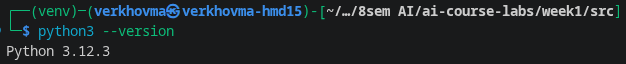
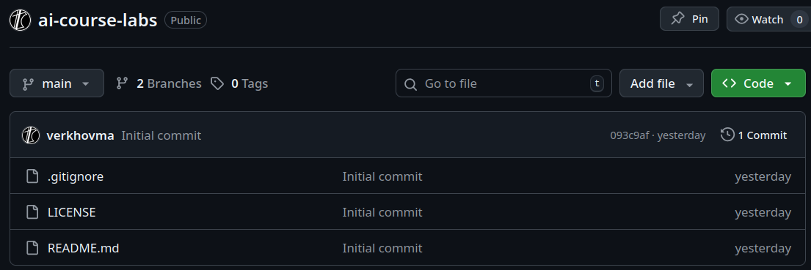
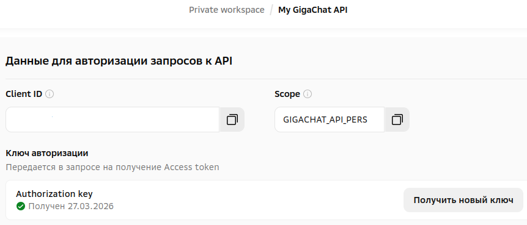
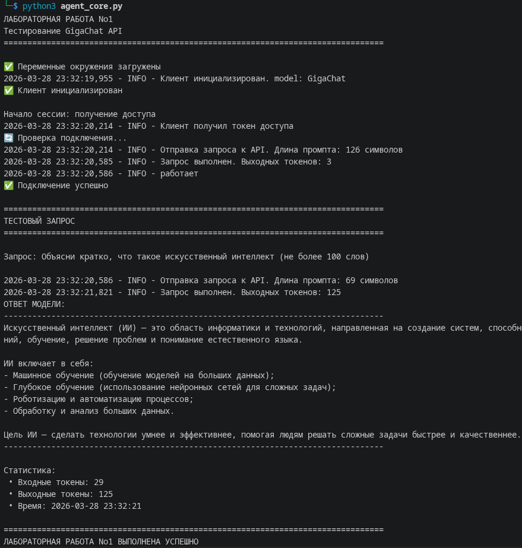

# Отчёт по лабораторной работе No1
## Дисциплина: Искусственный интеллект
---
## Общая информация
| Параметр | Значение |
|----------|----------|
| **Студент** | [Верхов Михаил Алексеевич] |
| **Группа** | [ФИТ-221] |
| **Дата выполнения** | [28.03.2026] |
| **Специальность** | [02.03.02 Фундаментальная информатика и информационные технологии] |
| **Тема диплома** | [Информационная система многоязычного сопровождения занятий с автоматизированным интеллектуальным переводом] |
---
## 1. Цель работы
Научиться выполнять запросы к удаленной LLM.
---
## 2. Выполненные задачи
- [ ✅ ] Настроено окружение Python 3.10+
- [ ✅ ] Создан GitHub-репозиторий
- [ ✅ ] Получены API-ключи GigaChat
- [ ✅ ] Реализован базовый вызов API
- [ ❌ ] Выполнен адаптированный запрос
---
## 3. Ход работы
### 3.1. Настройка окружения

# Команды установки
```bash
python --version
pip install -r requirements.txt
```
### 3.2. Создание репозитория

- URL репозитория: `https://github.com/verkhovma/ai-course-labs`
- Текущая ветка: `week1`
### 3.3. Получение API-ключей

### 3.4. Тестовый запрос
**Запрос:**
/```
Объясни кратко, что такое искусственный интеллект
/```
**Ответ:**
/```
Искусственный интеллект (ИИ) — это область информатики и технологий, направленная на создание систем, способных выполнять задачи, требующие человеческого интеллекта: распознавание речи, принятие решений, обучение, решение проблем и понимание естественного языка.

ИИ включает в себя:
- Машинное обучение (обучение моделей на больших данных);
- Глубокое обучение (использование нейронных сетей для сложных задач);
- Роботизацию и автоматизацию процессов;
- Обработку и анализ больших данных.

Цель ИИ — сделать технологии умнее и эффективнее, помогая людям решать сложные задачи быстрее и качественнее.
/```

### 3.5. Адаптированный запрос
### Задание не выполнялось
---
## 4. Результаты
| Критерий | Статус |
|----------|--------|
| Окружение настроено | ✅ |
| Репозиторий создан | ✅ |
| Ветка week1 создана | ✅ |
| API работает | ✅ |
| Адаптация выполнена | ❌ |
---
## 5. Выводы
#### изучено:
- выполнение запроса к удаленной LLM.
#### проблемы:
- нужно обновлять токен доступа к сессии каждые 30 минут.
- нужно использовать сертификат минцифры.
#### использование:
- создание распределенной системы с технологиями AI.
---
## 6. Список источников
1. Документация GigaChat API. URL: https://developers.sber.ru/docs/ru/gigachat/quickstart/ind-using-api
